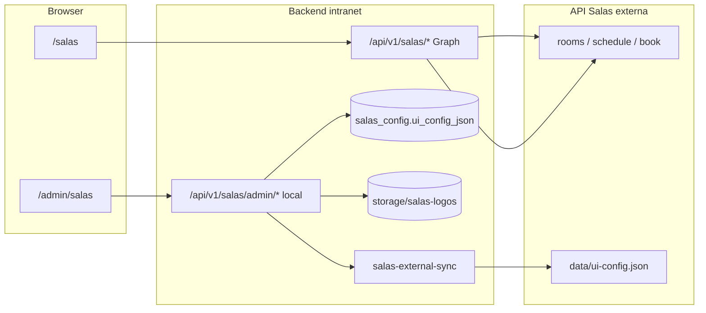

# Integração de Reserva de Salas — Intranet WTorre

Este documento descreve a **implementação interna** da intranet para consumir a API externa de Salas de Reunião. Para o contrato da API externa (consumo direto por outros sites), consulte [`INTEGRATION.md`](./INTEGRATION.md).

---

## 1) Visão geral

A intranet expõe uma **página pública autenticada** em `/salas` e um **proxy backend** em `/api/v1/salas/*` para operações Graph (salas, agenda, reservas). O **admin de abas e salas** é **local** na intranet (MySQL + storage) — não usa mais as rotas `/admin/*` da API externa.



| Camada | Responsabilidade |
|--------|------------------|
| **Frontend** (`/salas`) | Dashboard multi-aba, agenda por sala, modal de reserva |
| **Frontend admin** (`/admin/salas`) | Conexão, domínios/logos, mapeamento tenant, salas e ordem |
| **Proxy Graph** (`/api/v1/salas`) | JWT, validação de localidade, repasse à API externa |
| **Admin local** (`/api/v1/salas/admin`) | ui-config, logos e listagem de salas na intranet |
| **API externa** | Microsoft Graph, reservas, agenda (lê `ui-config.json` sincronizado) |

**Acesso público:** qualquer colaborador autenticado na intranet (`authGuard`) em `/salas`.

**Admin:** módulo RBAC `salas` em `/admin/salas`.

---

## 2) Configuração

### Variáveis de ambiente (backend)

| Variável | Descrição |
|----------|-----------|
| `SALAS_LOGOS_DIR` | Diretório local de logos (padrão: `backend/storage/salas-logos`) |
| `SALAS_SYNC_DATA_DIR` | Diretório `data/` da API SalasReuniao para sync do `ui-config.json` e logos (ex.: `/www/wwwroot/SalasReuniao/backend/data`) |

Ao salvar no admin, a intranet grava `ui-config.json` e copia logos para `SALAS_SYNC_DATA_DIR`, mantendo a API Graph externa alinhada com `belongsToApiLocalidade`.

### Painel Admin → Administração de áreas e salas (`/admin/salas`)

#### Card Conexão

| Campo | Descrição |
|-------|-----------|
| **Integração ativa** | Liga/desliga o proxy Graph |
| **URL da API** | URL base da API externa, **sem barra final** (ex.: `http://localhost:3002/api`) |
| **Aba padrão** | ID da aba inicial ao abrir `/salas` (ex.: `wtorre`) |

#### Painel de abas e salas (4 seções)

Após salvar conexão (URL + ativo), o painel carrega o `ui-config` **do banco da intranet**:

1. **Domínios e logos por site**
2. **Mapeamento domínio → Tenant Microsoft**
3. **Salas** — lista via `GET /rooms` da API Graph por tenant
4. **Ordem de exibição** por aba

O botão **Salvar alterações** persiste em `salas_config.ui_config_json` e sincroniza com a API externa.

### Contrato `ui-config` (fonte de verdade na intranet)

`GET /api/v1/salas/ui-config` lê do banco local:

```json
{
  "tabs": [
    {
      "id": "wtorre",
      "label": "Wtorre",
      "localidade": "WTorre",
      "value": "wtorre",
      "logoKey": "wtorre",
      "logoFile": "wtorre.png",
      "domains": ["wtorre.com.br"]
    }
  ],
  "domainToApiLocalidade": {
    "wtorre.com.br": "WTorre",
    "nubankparque.com.br": "Allianz"
  },
  "roomTabOverrides": {},
  "roomOrderByTab": { "wtorre": ["sala01@wtorre.com.br"] },
  "localidadePadrao": "wtorre",
  "apiLocalidades": ["WTorre", "Allianz"]
}
```

> `localidades_json` e `admin_api_key_*` são legado e não participam do fluxo admin atual.

---

## 3) Arquitetura backend

### Arquivos

| Arquivo | Função |
|---------|--------|
| `backend/src/repositories/salas-config.repository.js` | Persistência `salas_config` + `ui_config_json` |
| `backend/src/services/salas-ui-config.resolver.js` | Normalização e resolução de abas/domínios |
| `backend/src/services/salas-ui-config.service.js` | CRUD local do ui-config |
| `backend/src/services/salas-external-sync.service.js` | Sync para `SALAS_SYNC_DATA_DIR` |
| `backend/src/services/salas-admin.service.js` | Admin local: ui-config, rooms, logos |
| `backend/src/services/salas-api.client.js` | Cliente HTTP Graph (`x-localidade`) |
| `backend/src/services/salas.service.js` | Orquestração pública (ui-config local + proxy Graph) |
| `backend/src/db/migrations/048_salas_ui_config_local.sql` | Coluna `ui_config_json` |

### Rotas admin (módulo `salas`) — implementação local

| Rota | Método | Origem dos dados |
|------|--------|------------------|
| `/api/v1/salas/config` | GET/PUT | `salas_config` (conexão) |
| `/api/v1/salas/admin/ui-config` | GET/PUT | `ui_config_json` no banco |
| `/api/v1/salas/admin/rooms` | GET | `GET /rooms` Graph por tenant + ui-config local |
| `/api/v1/salas/admin/tabs/:tabId/logo` | POST/DELETE | `storage/salas-logos` |
| `/api/v1/salas/logos/:file` | GET | Arquivo local |

### Proxy Graph → API externa

| Proxy intranet | API externa |
|----------------|-------------|
| `/api/v1/salas/rooms?localidade=` | `/rooms` |
| `/api/v1/salas/schedule?localidade=` | `/schedule` |
| `/api/v1/salas/book?localidade=` | `/book` |
| `/api/v1/salas/bookings?localidade=` | `/bookings` |
| `/api/v1/salas/directory/users?localidade=` | `/directory/users` |

`GET /api/v1/salas/ui-config` **não** chama a API externa — lê o banco local.

---

## 4) Frontend

- `/salas` — multi-aba, filtro por `roomTabOverrides`, ordenação por `roomOrderByTab`
- `/admin/salas` — 4 seções + card conexão (sem chave admin)
- Regras de agendamento, conflitos e grade: [`salas-regras-agendamento.md`](./salas-regras-agendamento.md)

---

## 5) Performance e cache (`/salas`)

A página pública otimiza o carregamento em camadas:

| Dado | Escopo | TTL (frontend + backend proxy) |
|------|--------|----------------------------------|
| Lista de salas (`GET /rooms`) | Todas as localidades Graph, uma vez por sessão | 10 min |
| Agenda (`POST /schedule`) | Somente salas da aba ativa | 60 s |
| Reservas (`GET /bookings`) | Localidades da aba (global na aba Reservas) | 60 s |
| Config interna do proxy | MySQL `salas_config` | 30 s (backend) |

**Comportamento:**

- **Troca de aba:** instantânea se a aba/dia já foi carregada; senão busca agenda/reservas só daquela aba.
- **Mudança de data:** recarrega agenda e reservas (não refaz `GET /rooms`).
- **Atualizar disponibilidade:** ignora cache (frontend e backend) e recarrega tudo.
- **Após reserva/cancelamento:** invalida cache do dia e recarrega a aba atual.
- **Prefetch:** após carregar a aba ativa, prefetch em background da aba adjacente (~500 ms).

Cache expirado usa *stale-while-revalidate* no frontend: exibe dados em memória e atualiza em background.

---

## 6) Checklist de implantação

1. [ ] Migration 048 aplicada (`ui_config_json` em `salas_config`)
2. [ ] `SALAS_SYNC_DATA_DIR` apontando para `data/` da API SalasReuniao
3. [ ] ui-config importado (seed ou cópia do `ui-config.json` existente)
4. [ ] Módulo `salas` concedido em Gestão de Acessos
5. [ ] Admin salva alterações sem chave admin
6. [ ] `/salas` mostra abas distintas com salas corretas
7. [ ] Reserva de teste funciona via proxy Graph
8. [ ] `ui-config.json` externo atualiza após salvar no admin

---

## 7) Referências

| Documento | Conteúdo |
|-----------|----------|
| [`INTEGRATION.md`](./INTEGRATION.md) | Contrato da API externa de salas |
| [`salas-regras-agendamento.md`](./salas-regras-agendamento.md) | Regras de conflito, grade e reserva |
| [`padrao-modulos-admin.md`](./padrao-modulos-admin.md) | Padrão de módulos admin |
