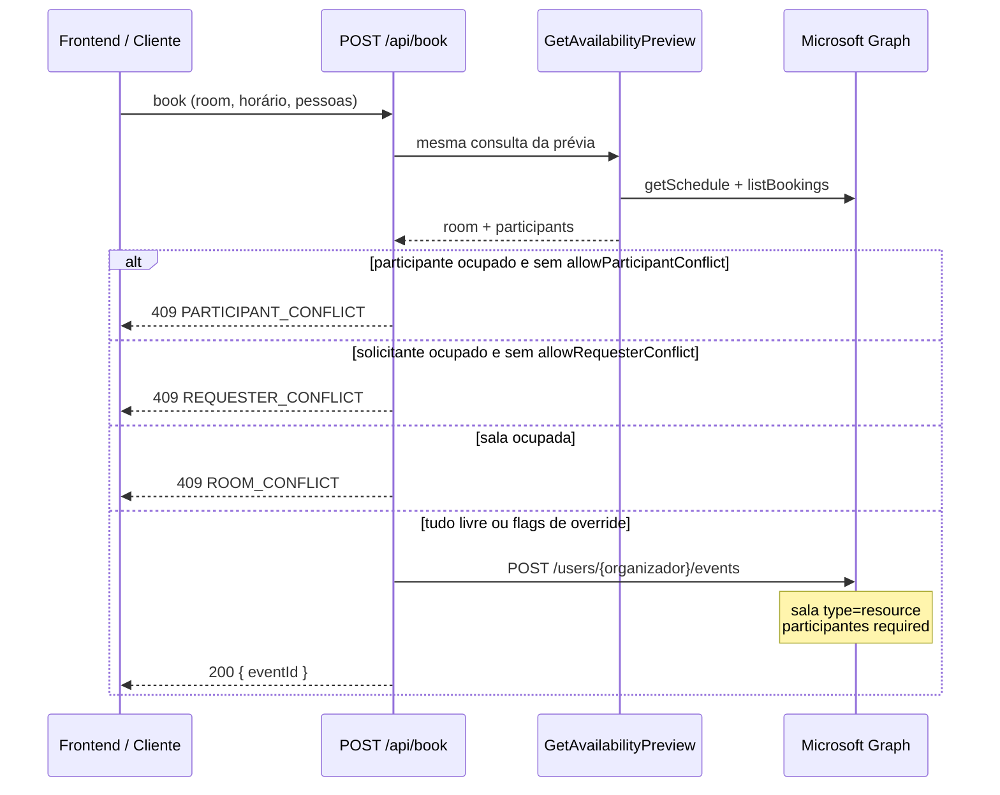

# Regras de agendamento, conflitos e tratativas

Documento de referência do comportamento **atual** do sistema (backend + frontend). A lógica central de sobreposição está na API externa SalasReuniao (`backend/src/domain/scheduleOverlap.ts`) e é espelhada na intranet em [`frontend/src/app/pages/salas/salas-schedule-overlap.ts`](../frontend/src/app/pages/salas/salas-schedule-overlap.ts).

---

## 1. Intervalo de tempo

| Regra | Detalhe |
|-------|---------|
| Formato | ISO 8601 (`start` e `end`) |
| Validação | `start` deve ser **estritamente anterior** a `end` (HTTP 400, `VALIDATION_ERROR`) |
| Sobreposição | Dois intervalos conflitam quando `startA < endB` **e** `endA > startB` |
| Fim exclusivo | O instante de fim **não** conta como ocupado |

### Exemplos de fim exclusivo

| Evento existente | Reserva pedida | Conflito? |
|------------------|----------------|-----------|
| 22:30 – 23:00 | 23:00 – 23:30 | Não |
| 22:30 – 23:30 | 23:00 – 23:30 | Sim |
| 21:00 – 21:30 | 21:30 – 22:00 | Não (adjacentes) |
| 23:00 – 23:30 | 23:00 – 23:30 | Sim |

---

## 2. O que conta como “ocupado”

### Itens de agenda (`getSchedule`)

- Qualquer item cujo `status` **não** seja `free` (case-insensitive) é considerado ocupado.
- Status típicos do Exchange/Graph: `busy`, `tentative`, `oof`, etc.

### `availabilityView` do Graph

- String de caracteres por slot de tempo.
- Caracteres `1`, `2`, `3`, `4` indicam ocupação no slot.
- Usado como reforço **somente para a sala**, quando `getSchedule` pode omitir eventos na janela consultada.
- **Participantes/organizador** usam apenas itens de `getSchedule` (conflitos com overlap no intervalo pedido) — evita falso “ocupado” por `availabilityView`.
- Na UI da intranet, `unknown` / `not_validated_contact` aparecem como **“Não verificado”** (não como “Ocupado”).

### Reservas do calendário da sala

- Eventos retornados por `listBookings` (calendarView da mailbox da sala) são fundidos com os itens do `getSchedule`.
- Evita “falso livre” quando há ocupação visível na grade mas sem evento no calendário da sala.

### Status de disponibilidade na pré-visualização

| `availabilityStatus` | Bloqueia reserva? |
|----------------------|-------------------|
| `available` | Não (salvo conflitos na lista) |
| `busy` | Sim |
| `unknown` | Sim |
| `not_validated_contact` | Sim |

---

## 3. Fluxo de reserva



### Modelo no Microsoft Graph (intranet)

Reservas feitas em `/salas` seguem o **Assistente de agendamento** do Outlook:

| Pergunta | Resposta |
|----------|----------|
| Quem organiza? | **E-mail escolhido no formulário** (`requesterEmail`). Default = usuário logado; dá para buscar outra pessoa no diretório. |
| Onde o evento é criado? | Calendário do organizador (`POST /users/{requesterEmail}/events`). |
| Como a sala é convidada? | Attendee `type: resource` (mailbox da sala) + campo `location`. |
| Participantes? | Attendees `type: required` no mesmo evento. |
| Fallback para calendário da sala? | **Não.** Se o Graph retornar 400/403/404 no calendário do organizador, a reserva falha com `REQUESTER_CALENDAR_UNAVAILABLE`. |
| Quem executa no Graph? | API SalasReuniao (credenciais app-only), em nome do tenant. |

**Implicações:**

- O `eventId` devolvido pertence ao calendário do organizador — cancelamento e check-in usam esse ID.
- A ocupação da grade da sala vem do convite como **recurso**, não apenas do texto em Local.
- O proxy da intranet **valida e encaminha** o `requesterEmail` do body (não sobrescreve com o JWT). Quem está autenticado precisa ter e-mail válido na sessão, mas o organizador da reserva pode ser outra pessoa.
- Cancelamento na intranet: **organizador da reserva** ou usuário com perfil `ADMIN`.

### Ordem de validação no `BookRoomUseCase`

1. Normaliza e-mails (trim + lowercase).
2. Solicitante é sempre incluído na lista de participantes (sem duplicar).
3. Executa **a mesma pré-visualização** usada em `POST /api/availability/preview`.
4. Verifica conflitos de **outros participantes** → `PARTICIPANT_CONFLICT` (409).
5. Verifica conflito do **solicitante** → `REQUESTER_CONFLICT` (409).
6. Verifica conflito da **sala** → `ROOM_CONFLICT` (409).
7. Cria o evento no Graph; se check-in estiver ativo na sala, marca categoria `SalasReuniao.RequireCheckIn`.

A pré-visualização **não bloqueia** — apenas informa. O bloqueio ocorre na reserva (salvo flags de override).

---

## 4. Tipos de conflito

| Código HTTP | `code` | Quando ocorre | Pode ignorar? |
|-------------|--------|---------------|---------------|
| 409 | `ROOM_CONFLICT` | Sala ocupada no intervalo | **Nunca** |
| 409 | `REQUESTER_CONFLICT` | Solicitante com compromisso sobreposto | Sim, com `allowRequesterConflict: true` |
| 409 | `PARTICIPANT_CONFLICT` | Outro participante ocupado | Sim, com `allowParticipantConflict: true` |
| 403/502 | `REQUESTER_CALENDAR_UNAVAILABLE` | Graph não criou evento no calendário do organizador (400/403/404) | **Não** |

### Mensagens padrão (API)

- `ROOM_CONFLICT`: *"A sala selecionada não está disponível neste horário."*
- `REQUESTER_CONFLICT`: *"O solicitante já possui compromisso neste horário."*
- `PARTICIPANT_CONFLICT`: *"A agenda de outro participante está ocupada neste horário: {emails}."*
- `REQUESTER_CALENDAR_UNAVAILABLE`: *"Não foi possível criar a reserva no seu calendário. Verifique permissões do aplicativo ou tente novamente."*

### Flags no `POST /api/book`

```json
{
  "allowRequesterConflict": false,
  "allowParticipantConflict": false
}
```

| Flag | Padrão | Efeito |
|------|--------|--------|
| `allowRequesterConflict` | `false` | Permite reservar com o solicitante ocupado |
| `allowParticipantConflict` | `false` | Permite reservar com participantes ocupados |

**Importante:** `allowRequesterConflict: true` **não** libera conflito de outros participantes — é necessário `allowParticipantConflict: true` também.

---

## 5. Participantes e multi-tenant

- E-mails são normalizados para minúsculas.
- O solicitante entra automaticamente na verificação de agenda.
- Participantes duplicados são removidos.
- Para cada participante, o domínio do e-mail é mapeado para uma localidade via `domainToApiLocalidade` (UI config).
- Participante com domínio **não mapeado** → `not_validated_contact` → **bloqueia** reserva.
- Participante de **outro tenant** → consulta `getSchedule` no tenant correto.
- Tenant do participante não encontrado → `unknown` → **bloqueia** reserva.

### Janela de consulta de agenda

- O início da janela é recuado **180 minutos** antes do `start` pedido.
- Motivo: o Graph pode omitir eventos que terminam exatamente no início do intervalo com janelas estreitas.

---

## 6. Grade de horários (frontend)

| Parâmetro | Valor |
|-----------|-------|
| Granularidade da grade | Blocos de **30 minutos** (48 slots/dia) |
| Fuso de exibição | Brasil (`-03:00`) |
| Horário comercial (métricas) | 09:00 – 17:00 |
| Slots passados | Não clicáveis |
| Slot parcial | Do instante atual até o fim do bloco de 30 min atual, se livre |
| Duração mínima | 30 min (múltiplos de 30 min encadeados livres) |

### Opções de hora de fim

- Só são oferecidas durações que cabem em slots **consecutivos livres** a partir do início escolhido.
- Para na primeira slot `occupied` encontrada.

### Detecção de conflito de sala no formulário

1. Pré-visualização da API (`blocksBooking` sobre `preview.room`).
2. Fallback: slots da grade com `status === 'occupied'` que sobrepõem o intervalo selecionado.

---

## 7. Tratativas no frontend (`SalasBookingModalComponent`)

| Situação | Comportamento |
|----------|---------------|
| Organizador | Busca no diretório (default = usuário logado); reserva no calendário escolhido |
| Sala ocupada | Botão *"Sala indisponível"*; submit bloqueado |
| Solicitante ou participante ocupado | Botão *"Conflito na agenda"*; ao confirmar, abre diálogo |
| Diálogo de confirmação | Envia `allowRequesterConflict: true` **e** `allowParticipantConflict: true` |
| `ROOM_CONFLICT` na API | Toast de erro; recarrega slots da sala |
| `REQUESTER_CONFLICT` / `PARTICIPANT_CONFLICT` na API | Toast específico (race condition se alguém ocupou entre prévia e reserva) |

A pré-visualização é recarregada com debounce de **300 ms** quando título, horários, organizador ou participantes mudam.

---

## 8. Reservas fora da app (Outlook)

| Cenário | Grade | Lista de reservas | Cancelamento pela app |
|---------|-------|-------------------|------------------------|
| Sala convidada como recurso (mailbox) | Ocupada | Aparece (`source: calendar`) | Sim |
| Só no calendário do organizador | Ocupada | Aparece via merge (`source: schedule`) | Limitado — precisa de `eventId` Graph válido |
| ID sintético `schedule:...` | Ocupada | Aparece na lista | **Não** cancelável pela app |

Recomendação: usar o **Assistente de agendamento** do Outlook e adicionar a **mailbox da sala** como participante/recurso.

---

## 9. Check-in e no-show

### Quando o check-in é exigido

- Modo check-in ativo na sala (`checkInModeEnabled` em kiosk settings).
- Novas reservas recebem categoria Outlook `SalasReuniao.RequireCheckIn`.

### Check-in (`POST /api/bookings/:eventId/check-in`)

| Código | Situação |
|--------|----------|
| 404 `BOOKING_NOT_FOUND` | Evento não localizado |
| 409 `CHECKIN_NOT_REQUIRED` | Reserva/sala sem exigência de check-in |
| 409 `ALREADY_CHECKED_IN` | Check-in já feito |
| 204 | Sucesso — categoria `SalasReuniao.CheckedIn` |

### Cancelamento automático (no-show)

Job periódico (`ProcessNoShowBookingsUseCase`):

1. Percorre salas com check-in ativo.
2. Lista reservas do dia na mailbox da sala.
3. Ignora IDs sintéticos (`schedule:...`).
4. Se `requiresCheckIn && !checkedIn` e já passou `início + tolerância` → cancela.
5. Tolerância padrão: **15 minutos** (configurável por sala: 1–60 min).

---

## 10. Funções de referência (intranet)

```typescript
// Há sobreposição real?
overlapsInterval(requestStart, requestEnd, itemStart, itemEnd): boolean

// Item de agenda conta como ocupado?
isBusyScheduleStatus(status): boolean  // tudo exceto "free"

// Entidade bloqueia reserva?
blocksBooking(requestStart, requestEnd, entity): boolean
// true se availabilityStatus ∈ { busy, unknown, not_validated_contact }
// ou se hasBookingConflict sobre entity.conflicts
```

Implementação: [`salas-schedule-overlap.ts`](../frontend/src/app/pages/salas/salas-schedule-overlap.ts).

---

## 11. Endpoints relacionados

| Método | Rota (proxy intranet) | Papel |
|--------|------------------------|-------|
| `POST` | `/api/v1/salas/schedule` | Agenda do dia (grade) |
| `POST` | `/api/v1/salas/availability/preview` | Pré-visualização de conflitos |
| `POST` | `/api/v1/salas/book` | Criar reserva (com validação) |
| `GET` | `/api/v1/salas/bookings` | Listar reservas |
| `DELETE` | `/api/v1/salas/bookings/:eventId` | Cancelar |
| `POST` | `/api/v1/salas/bookings/:eventId/check-in` | Check-in |

Ver também: [`INTEGRATION.md`](./INTEGRATION.md) para exemplos de integração e [`salas-integracao.md`](./salas-integracao.md) para a implementação na intranet.
